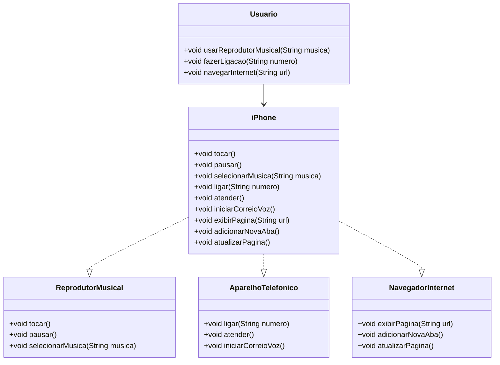

# Desafio DIO - Modelando o Iphone

## Diagrama UML (Mermaid)

```mermaid
classDiagram
    class ReprodutorMusical {
        +void tocar()
        +void pausar()
        +void selecionarMusica(String musica)
    }

    class AparelhoTelefonico {
        +void ligar(String numero)
        +void atender()
        +void iniciarCorreioVoz()
    }

    class NavegadorInternet {
        +void exibirPagina(String url)
        +void adicionarNovaAba()
        +void atualizarPagina()
    }

    class iPhone {
        +void tocar()
        +void pausar()
        +void selecionarMusica(String musica)
        +void ligar(String numero)
        +void atender()
        +void iniciarCorreioVoz()
        +void exibirPagina(String url)
        +void adicionarNovaAba()
        +void atualizarPagina()
    }

    class Usuario {
        +void usarReprodutorMusical(String musica)
        +void fazerLigacao(String numero)
        +void navegarInternet(String url)
    }

    iPhone ..|> ReprodutorMusical
    iPhone ..|> AparelhoTelefonico
    iPhone ..|> NavegadorInternet

    Usuario --> iPhone
```

